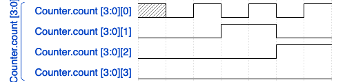

# VCD Oxide

An experiment in Value Change Dump (VCD) oxidation. Intended to be compliant with IEEE STD 1364-2005.

## Usage

```
Usage: vcd-oxide [OPTIONS] <FILE>

Arguments:
  <FILE>  

Options:
  -e, --expand-busses  Expand busses into individual signals
  -h, --help           Print help
  -V, --version        Print version
```

A counter example is provided in the `simulations` directory. It's build using `iverilog`. 
If you do not have it installed I recommend doing so using [icicle](https://github.com/nishtahir/icicle)

```
module Counter;

logic [3:0] count;

initial begin
    $dumpfile("Counter.vcd");
    $dumpvars(0, Counter);
    // count to 5
    #1 count = 0;
    #1 count = 1;
    #1 count = 2;
    #1 count = 3;
    #1 count = 4;
    #1 count = 5;
end

endmodule
```

```
$ cargo run -- ./simulations/Counter.vcd
```

This will create a Counter.json file with the WaveJson content

```
{
  "signal": [
    {
      "name": "Counter.count [3:0]",
      "wave": "=======",
      "data": [
        "bx",
        "b0",
        "b1",
        "b10",
        "b11",
        "b100",
        "b101"
      ]
    }
  ]
}
```

You can now use [WaveDrom](https://wavedrom.com/editor.html?%7B%0A%20%20%22signal%22%3A%20%5B%0A%20%20%20%20%7B%0A%20%20%20%20%20%20%22name%22%3A%20%22Counter.count%20%5B3%3A0%5D%22%2C%0A%20%20%20%20%20%20%22wave%22%3A%20%22%3D%3D%3D%3D%3D%3D%3D%22%2C%0A%20%20%20%20%20%20%22data%22%3A%20%5B%0A%20%20%20%20%20%20%20%20%22bx%22%2C%0A%20%20%20%20%20%20%20%20%22b0%22%2C%0A%20%20%20%20%20%20%20%20%22b1%22%2C%0A%20%20%20%20%20%20%20%20%22b10%22%2C%0A%20%20%20%20%20%20%20%20%22b11%22%2C%0A%20%20%20%20%20%20%20%20%22b100%22%2C%0A%20%20%20%20%20%20%20%20%22b101%22%0A%20%20%20%20%20%20%5D%0A%20%20%20%20%7D%0A%20%20%5D%0A%7D) to generate an `*.svg` file.


By providing the `--expand-busses` flag, you can expand a bus signal into individual lanes.

```
$ cargo run -- ./simulations/Counter.vcd --expand-busses
```




## Resources
1. [IEEE Standard for Verilog® Hardware Description Language](https://ieeexplore.ieee.org/document/1620780)
2. [Pest](https://pest.rs/)
3. [WaveDrom/WaveJson](https://wavedrom.com/tutorial.html)